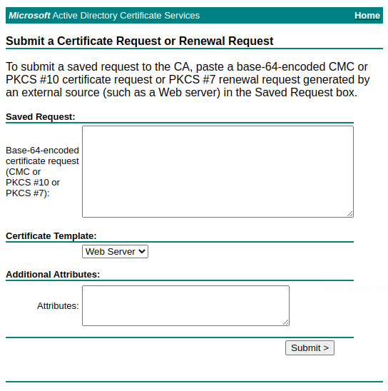

# bash_adcs

1. [wincert](#wincert)  : create CSR and send to ADCS
2. [winsign](#winsign)  : send existing CSR to ADCS
3. [makecsr](#makecsr)  : make basic CSR
4. [selfsigned](#selfsigned)  : make self-signed certificate

## Description

BASH script to request a certificate from Active Directory Certificate Services (ADCS).

> Supports Elliptic Curve of 256, 384, 521 bits and RSA keys of 2048 and 4096 bits.

It works by using Curl to post to https://{ADCS}/certsrv/certrqxt.asp



<!--- { width=60%,height:30px } --->

## Requirements

- BASH
- openssl
- curl
- sed, tail, cut

## Usage

### wincert


Create a CSR then send to ADCS. If successful, retrieve the certifcate chain and create a PFX file containing the chain and private key.

```

Usage:
  wincert [-r|-e] [-b 256|384|521|2048|4096] [-s "/C=/ST=/O="] [-t WebServer] [-u AD_Username ] [-p AD_Password] certificate.common.name [subject.alt.name|subject.I.P.address]

  -h, -help,  --help         Display help.
  -r, -rsa,   --rsa          Create RSA key of 2048 or 4096 bits.
  -e, -ecc,   --ecc          Create ECC key of 256, 384, or 521 bits.
  -b, -bits,  --bits         Key bit size. Defaults to 2048 for RSA, 256 for ECC.
  -s, -subj,  --subject      Certificate subject in form /C=/ST=/L=/O=/OU=/CN=/emailAddress=  (default: "/OU=Domain Validated/CN=")
  -t, -temp,  --template     ADCS Template (default: WebServer)
  -u, -user,  --username     Active Directory Username
  -p, -pass,  --password     Active Directory Password

Examples:

  #1: CN=sample.lab.home
  wincert --ecc --bits 384 --subject "/C=AU/ST=Western Australia/O=Home" sample.lab.home sample@lab.home 127.0.0.1

  #2: CN=first.lab.home, sample.lab.home is added to Subject Alternate Name
  wincert --ecc --bits 384 --subject "/C=AU/ST=Western Australia/O=Home/CN=first.lab.home" sample.lab.home sample@lab.home 127.0.0.1

```

### winsign


Send an existing Certificate Signing Request (CSR) to ADCS. Adds a tempplate of 'WebServer' and a Subject Alternate Name (SAN) if they don't exist in the CSR. Won't replace either.

```

Usage:
  winsign [-t WebServer] [-u AD_Username ] [-p AD_Password] certificate.signing.request [subject.alt.name | subject.IP.address]

  -h, -help,  --help         Display help.
  -t, -temp,  --template     ADCS Template (default: WebServer)
  -u, -user,  --username     Active Directory Username
  -p, -pass,  --password     Active Directory Password

Examples:

  #1: CN={taken from subject in CSR}. SAN, if not in CSR, will include CN from subject in CSR.
  winsign sample_lab_home.csr -u Administrator -p Passw0rd!

  #2: CN={taken from subject in CSR}. SAN, if not in CSR, will include CN from subject in CSR plus email sample@lab.home, IPv4 127.0.0.1, and IPv6 ::1.
  winsign sample_lab_home.csr sample@lab.home 127.0.0.1 ::1

```

### makecsr


Makes a basic (not request extensions) Certificate Signing Reuest (CSR).

```

Usage:
  makecsr [-r|-e] [-b 256|384|521|2048|4096] [-s /C=/ST=/O=] certificate.common.name

  -h, -help,  --help         Display help.
  -r, -rsa,   --rsa          Create RSA key of 2048 or 4096 bits.
  -e, -ecc,   --ecc          Create ECC key of 256, 384, or 521 bits.
  -b, -bits,  --bits         Key bit size. Defaults to 2048 for RSA, 256 for ECC.
  -s, -subj,  --subject      Certificate subject in form /C=/ST=/L=/O=/OU=/CN=/emailAddress=

Examples:

  #1: CN=sample.lab.home
  makecsr --ecc --bits 521 --subject "/C=AU/ST=Western Australia/O=Home" sample.lab.home

  #2: CN=first.lab.home, sample.lab.home is ignored
  makecsr --ecc --bits 521 --subject "/C=AU/ST=Western Australia/O=Home/CN=first.lab.home" sample.lab.home

```

### selfsigned


Makes a self-signed certificate.

> Not much to do with ADCS, only here because it was used to check command line processing.

```

Usage:
  selfsigned [-r|-e] [-b 256|384|521|2048|4096] [-d 365] certificate.common.name [subject.alternate.name and/or subject.ip.address]

  -h, -help,  --help         Display help.
  -r, -rsa,   --rsa          Create RSA key of 2048 or 4096 bits.
  -e, -ecc,   --ecc          Create ECC key of 256, 384, or 521 bits.
  -b, -bits,  --bits         Key bit size. Defaults to 2048 for RSA, 256 for ECC.
  -d, -days,  --days         Certificate validity period in days. Defaults to 365.
  -s, -subj,  --subject      Certificate subject in form /C=/ST=/L=/O=/OU=/CN=/emailAddress=

Examples:

  #1: CN=sample.lab.home, sample@lab.home is a SAN
  selfsigned --ecc --bits 521 --days 3654 --subject "/C=AU/ST=Western Australia/O=Home" sample.lab.home sample@lab.home 127.0.0.1 ::1

  #2: CN=first.lab.home, sample.lab.home is a SAN
  selfsigned --ecc --bits 521 --days 3654 --subject "/C=AU/ST=Western Australia/O=Home/CN=first.lab.home" sample.lab.home sample@lab.home 127.0.0.1 ::1

```
